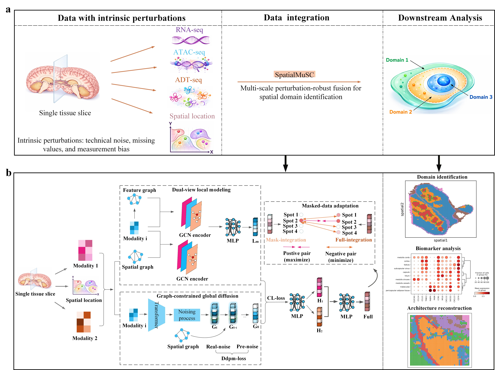

## SpatialMuSC
### Overall architecture of the SpatialMuSC algorithm pipeline:

 

## 1. Introduction  
A multi-scale perturbation-robust fusion model for
spatial multi-omics domain identification

## 2. Requirements 
You'll need to install the following packages in order to run the codes.
- python==3.10.13 
- torch==2.7.1+cu128
- tqdm==4.67.1 
- scipy==1.8.1
- anndata==0.8.0
- scikit-learn==1.3.0
- numpy==1.24.3    
- scanpy==1.11.4
- pandas==2.3.2
- seaborn==0.13.2
- matplotlib==3.9.4
- rpy2==3.6.3
- scikit-misc==0.5.1
- R==4.5.0  
- mclust==6.1.1

## 3. Tutorial and reproducibility
For the step-by-step tutorial, please refer to: [https://SpatialMuSC-tutorials/reproducibility/](https://github.com/CSUBioGroup/SpatialMuSC/tree/master/SpatialMuSC-main/SpatialMuSC-main/reproducibility/)

## 4. Comparative Models
The following models and methods are referenced:
- **SpaMI**: [PLOS Computational Biology](https://journals.plos.org/ploscompbiol/article?id=10.1371/journal.pcbi.1013546)
- **SpatialGlue**: [Nature Methods](https://www.nature.com/articles/s41592-024-02316-4)
- **COSMOS**: [Nature Communications](https://www.nature.com/articles/s41467-024-55204-y)
- **PRAGA**: [AAAI Conference on Artificial Intelligence](https://ojs.aaai.org/index.php/AAAI/article/view/32010)
- **SpaMGCN**: [Genome Biology](https://link.springer.com/article/10.1186/s13059-025-03637-z)
- **TotalVI**: [Nature Methods](https://www.nature.com/articles/s41592-020-01050-x)
- **SpaDDM**: [Proceedings of the National Academy of Sciences](https://www.pnas.org/doi/abs/10.1073/pnas.2517283123)
- **SSGATE**: [Briefings in Bioinformatics](https://academic.oup.com/bib/article/25/5/bbae450/7760130?guestAccessKey=)

## 5. Data availability
### 5.1 Real dataset
The datasets were derived from publicly available sources: 
- Human lymph node dataset: [10x Genomics Visium](https://github.com/CSUBioGroup/SpatialMuSC/tree/master/data/Dataset11_Human_Lymph_Node_A1)
- Mouse thymus dataset: [Stereo-CITE-seq](https://github.com/CSUBioGroup/SpatialMuSC/tree/master/data/Dataset3_Mouse_Thymus1)
- Mouse spleen dataset: [SPOTS](https://github.com/CSUBioGroup/SpatialMuSC/tree/master/data/Dataset1_Mouse_Spleen1)
- Adult human brain hippocampus dataset: [Spatial-epigenome-transcriptome](https://github.com/CSUBioGroup/SpatialMuSC/tree/master/data/Dataset21_human_brain_hipp_raw)
### 5.2 Mask dataset
The mask datasets come from human brain hippocampus.
- **Dataset 1, Dataset 2, Dataset 3**:
  - Each dataset corresponds to dropout rates of 50%, 70% and 90% dropout dataset.
  - Compute the average of the results with the same dropout rate.
- **Architecture reconstruction**:
  - GCL region masking.

  
